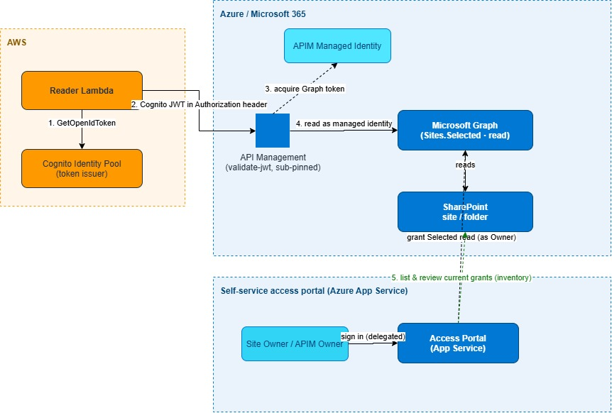

# Secretless AWS Lambda → SharePoint Read

Reference implementation for reading SharePoint content from an AWS Lambda with
**no stored secret, certificate, or password**.

**Design (Option D):**
Lambda → Cognito JWT → APIM `validate-jwt` → APIM managed identity → Microsoft
Graph (`Selected` read) → SharePoint.

Plus a **self-service portal** so a SharePoint site Owner can grant the reader
directory-level read access themselves (no admin, no secret).

## Architecture



Editable source: [`docs/architecture.drawio`](./docs/architecture.drawio).

See:
- [`PRODUCT-SPEC.md`](./PRODUCT-SPEC.md) — the full product spec.
- [`docs/RUNBOOK.md`](./docs/RUNBOOK.md) — cutover + steady-state operations.

## Stack

| Area | Tool |
|---|---|
| AWS infra (Cognito, Lambda) | Terraform |
| Azure infra (APIM, managed identity) | Bicep |
| Lambda | Python |
| Self-service portal | FastAPI backend + React frontend, hosted on **Azure App Service** |

## Repo layout

```
infra/
  cognito/        # Terraform: Cognito Identity Pool + token-minter Lambda IAM
  azure/          # Bicep: APIM + managed identity (main.bicep) + monitoring
lambda/
  token_minter/   # Mint & return a Cognito JWT
  reader/         # Mint token -> call APIM -> read a folder
apim/
  validate-jwt.xml  # Starter inbound token-validation policy
  policy.xml        # Full policy: validate-jwt -> managed identity -> Graph
scripts/
  decode_jwt.py           # Inspect a Cognito JWT's claims
  grant_selected_read.py  # Grant the MI read on a site (Graph)
  recertify_grants.py     # Flag / revoke stale grants
portal/           # Self-service access portal (FastAPI backend + React frontend)
tests/            # Live negative/positive APIM tests
docs/
  RUNBOOK.md      # Cutover + steady-state operations
```

## Quick start

### Azure side (deployable independently)

```bash
az group create -n rg-sharepoint-bridge -l eastus
az deployment group create -g rg-sharepoint-bridge \
  --template-file infra/azure/main.bicep \
  --parameters infra/azure/main.bicepparam
```

Placeholders (`identityPoolId`, `allowedCognitoSub`) are safe to deploy as-is; the
gateway comes up and you fill real values once the AWS side mints a token. Full
steps in [`infra/azure/README.md`](./infra/azure/README.md).

### AWS side (Cognito hop — validate this first to de-risk)

1. `cd infra/cognito && terraform init && terraform apply`
2. Invoke the `token_minter` Lambda; capture the returned `token`.
3. `python scripts/decode_jwt.py <token>` — record the real `iss` / `aud` / `sub`.
4. Apply `apim/validate-jwt.xml` to a test APIM API and confirm it accepts a
   valid token and rejects a tampered/expired one.

> **Go/No-Go (spec §6):** APIM returns 200 for a valid token, 401 for an invalid
> one, and you've documented whether OpenID auto-discovery or the direct JWKS URL
> was needed. This is the highest-risk hop — prove it before wiring the rest.

### Self-service portal (Azure App Service)

The portal (`portal/`) is a FastAPI backend + React (MSAL/PKCE) frontend that
runs on **Azure App Service**. A site Owner signs in and grants the pinned APIM
managed identity read access to a directory they own — no admin, no secret.

Run locally for development, or deploy to App Service. See
[`portal/README.md`](./portal/README.md) for both.

## End-to-end flow

```
Lambda ──Cognito JWT──▶ APIM (validate-jwt, sub-pinned)
                          └─ managed identity ──▶ Microsoft Graph (Selected read)
                                                     └──▶ SharePoint folder

Site Owner ──▶ Portal (App Service, delegated) ──▶ grants the APIM MI read on a directory
```

## Validation

| Check | Result |
|---|---|
| Python (`py_compile`, all files) | ✅ |
| `terraform validate` (infra/cognito) | ✅ |
| `bicep build` (main + monitoring) | ✅ |
| Portal app import + routes + SQLite store | ✅ |
